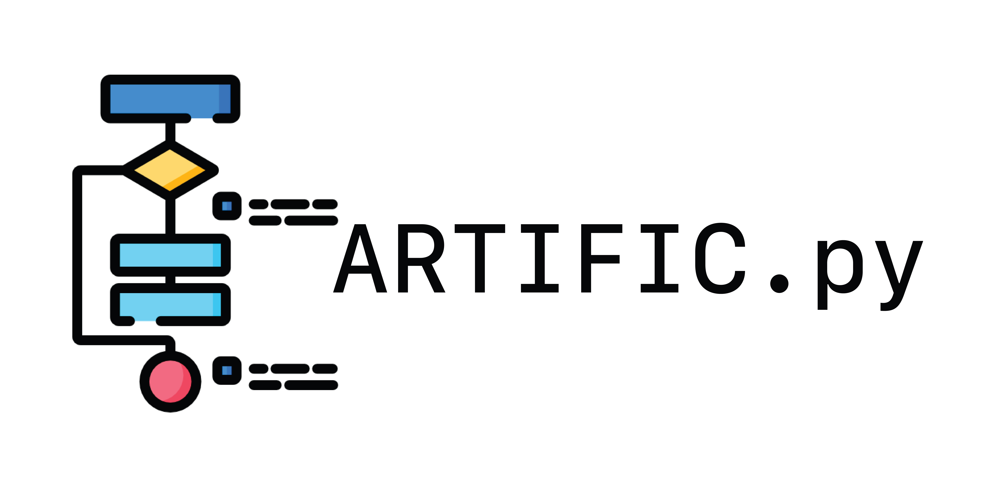

<!-- PROJECT LOGO -->
<br />
<div align="center">
  <a href="https://github.com/othneildrew/Best-README-Template">
    
  </a>

  <p align="center">
    An algorithm visualization pip package for Python
    <br />
    <a href="https://artific-doc.readthedocs.io"><strong>Explore the docs »</strong></a>
    <br />
    <br />
    <a href="https://github.com/othneildrew/Best-README-Template">View Demo</a>
    ·
    <a href="https://github.com/othneildrew/Best-README-Template/issues">Report Bug</a>Ç
    ·
    <a href="https://github.com/othneildrew/Best-README-Template/issues">Request Feature</a>
  </p>
  <div align="center">
<a href='https://artific-doc.readthedocs.io/en/main/?badge=main'>
    
</a>
<a href='https://pypi.python.org/pypi/artific'>
    
</a>
<a href='https://travis-ci.com/waasnipun/artific'>
    
</a>
<a href='https://opensource.org/licenses/MIT'>
    
</a>
</div>

</div>
<!-- TABLE OF CONTENTS -->

  <summary>Table of Contents</summary>
  <ol>
    <li>
      <a href="#getting-started">Getting Started</a>
      <ul>
        <li><a href="#installation">Installation</a></li>
      </ul>
    </li>
    <li>
      <a href="#algorithms">Algorithms</a>
      <ul>
        <li>
            <a href="#sorting">Sorting</a>
            <ul>
                <li><a href="#bubblesort">Bubblesort</a></li>
                <li><a href="#mergesort">Mergesort</a></li>
                <li><a href="#mergesort">Heapsort</a></li>
                <li><a href="#insertionsort">Insertionsort</a></li>
                <li><a href="#quicksort">Quicksort</a></li>
            </ul>
        </li>
      </ul>
    </li>
    <li><a href="#notebooks">Notebooks</a></li>
    <li><a href="#roadmap">Roadmap</a></li>
    <li><a href="#contributing">Contributing</a></li>
    <li><a href="#license">License</a></li>
    <li><a href="#contact">Contact</a></li>
    <li><a href="#acknowledgments">Acknowledgments</a></li>
  </ol>

## Getting Started
## Installation
### Stable release
To install artific, run this command in your terminal
```
pip install artific
```
This is the preferred method to install artific, as it will always install the most recent stable release.

If you don't have <a href="https://pip.pypa.io">pip</a>  installed, this <a href="http://docs.python-guide.org/en/latest/starting/installation/">Python installation guide</a>  can guide
you through the process. <br></br>

## Algorithms
### Sorting
#### Bubblesort
```
from artific import BubbleSort

arr = [90,6,2,55,67,2,0,12,92,5,76,2,9,3]
arr = BubbleSort(arr)

print(arr)
```

The code above will generate the following GIF


Credits
-------

This package was created with <a href="https://github.com/audreyr/cookiecutter">Cookiecutter</a> and the <a href="https://github.com/audreyr/cookiecutter-pypackage">audreyr/cookiecutter-pypackage</a> project template.

